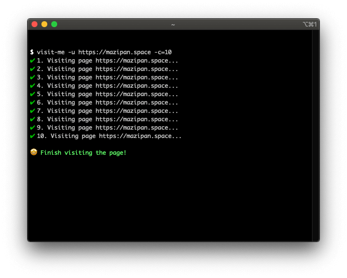

# 🏖 visit-me

Visit your web page easier using CLI, powered by Puppeteer and Node-Fetch

 [](https://www.npmjs.com/package/visit-me) 



## Install

```
$ npm i -g visit-me
```

## Usage

```
$ visit-me -u [YOUR_WEB_URL]
```

## Additional Options

| Argument        | Alias | Description                             | Data Type | Default Value |
| --------------- | ----- | --------------------------------------- | --------- | ------------- |
| `--count`       | `-c`  | Visit count                             | `number`  | `1`           |
| `--mobile`      | `-m`  | Using mobile device                     | `boolean` | `false`       |
| `--show-ui`     | `-ui` | Show the browser when visiting          | `boolean` | `false`       |
| `--simple-mode` | `-sm` | Use `node-fetch` instead of `puppeteer` | `boolean` | `false`       |
| `--bot`         | `-b`  | Use Bot user agent                      | `boolean` | `false`       |
| `--agent`       | `-ua` | Custom user agent                       | `string`  | empty         |

## Support me

- 👉 🇮🇩 [Trakteer](https://trakteer.id/mazipan?utm_source=github)
- 👉 🌍 [BuyMeACoffe](https://www.buymeacoffee.com/mazipan?utm_source=github)
- 👉 🌍 [Paypal](https://www.paypal.me/mazipan?utm_source=github)
- 👉 🌍 [Ko-Fi](https://ko-fi.com/mazipan)

---

Copyright © 2020 Built with ❤️ by Irfan Maulana
